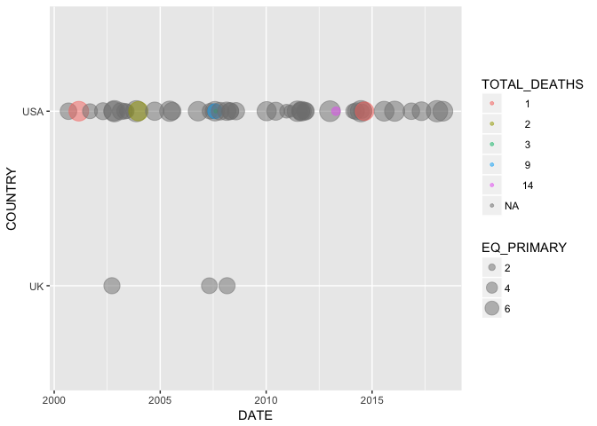

# Travis status image
https://travis-ci.org/JulianTWolf/RCapstone.svg?branch=master

<!-- README.md is generated from README.Rmd. Please edit that file -->
RCapstone
=========

The goal of RCapstone is to clean, timeline and map NOAA Significant Earthquake data. The package was built for the Capstone project of the Coursera Mastering Software Development in R specialization.

Installation:
-------------

To install the package first install and load the devtools package. Then run:

``` r
devtools::install_github("JulianTWolf/RCapstone")
#> Skipping install of 'RCapstone' from a github remote, the SHA1 (5501cc57) has not changed since last install.
#>   Use `force = TRUE` to force installation
library(RCapstone)
```

Example
-------

This is a basic example which shows you how to solve a common problem:

``` r
library(dplyr)
#> 
#> Attaching package: 'dplyr'
#> The following objects are masked from 'package:stats':
#> 
#>     filter, lag
#> The following objects are masked from 'package:base':
#> 
#>     intersect, setdiff, setequal, union
library(ggplot2)
library(RCapstone)
data_raw <<- readr::read_delim("/Users/julian/Documents/07 Sonstiges/R-Projekte/RCapstone/signif.txt.tsv", col_names=T, delim = "\t")
#> Parsed with column specification:
#> cols(
#>   .default = col_integer(),
#>   FLAG_TSUNAMI = col_character(),
#>   SECOND = col_character(),
#>   EQ_PRIMARY = col_character(),
#>   EQ_MAG_MW = col_character(),
#>   EQ_MAG_MS = col_character(),
#>   EQ_MAG_MB = col_character(),
#>   EQ_MAG_ML = col_double(),
#>   EQ_MAG_MFA = col_character(),
#>   EQ_MAG_UNK = col_character(),
#>   COUNTRY = col_character(),
#>   STATE = col_character(),
#>   LOCATION_NAME = col_character(),
#>   LATITUDE = col_character(),
#>   LONGITUDE = col_character(),
#>   DEATHS = col_character(),
#>   MISSING = col_character(),
#>   INJURIES = col_character(),
#>   DAMAGE_MILLIONS_DOLLARS = col_character(),
#>   TOTAL_DEATHS = col_character(),
#>   TOTAL_MISSING = col_character()
#>   # ... with 2 more columns
#> )
#> See spec(...) for full column specifications.
eq_clean_data(eq_location_clean(data_raw))


data_clean %>% dplyr::filter(COUNTRY %in% c('USA', 'UK')) %>% dplyr::filter(DATE > '2000-01-01') %>% ggplot(aes(x = DATE, y = COUNTRY, color = TOTAL_DEATHS, size = EQ_PRIMARY)) + geom_timeline()
```



``` r

data_clean %>% dplyr::filter(COUNTRY == "MEXICO" & lubridate::year(DATE) >= 2000) %>%
  dplyr::mutate(popup_text = eq_create_label(.)) %>%
  eq_map(annot_col = "popup_text")
```

<!--html_preserve-->

<script type="application/json" data-for="htmlwidget-d7c8f5257c18303ddb06">{"x":{"options":{"crs":{"crsClass":"L.CRS.EPSG3857","code":null,"proj4def":null,"projectedBounds":null,"options":{}}},"calls":[{"method":"addTiles","args":["//{s}.tile.openstreetmap.org/{z}/{x}/{y}.png",null,null,{"minZoom":0,"maxZoom":18,"tileSize":256,"subdomains":"abc","errorTileUrl":"","tms":false,"noWrap":false,"zoomOffset":0,"zoomReverse":false,"opacity":1,"zIndex":1,"detectRetina":false,"attribution":"&copy; <a href=\"http://openstreetmap.org\">OpenStreetMap<\/a> contributors, <a href=\"http://creativecommons.org/licenses/by-sa/2.0/\">CC-BY-SA<\/a>"}]},{"method":"addCircleMarkers","args":[[18.194,32.319,16.87,18.77,17.488,26.319,17.302,32.456,32.437,32.297,16.396,17.844,16.493,16.878,17.397,17.235,14.728,17.682,15.022,18.584,16.737,16.646],[-95.908,-115.322,-100.113,-104.104,-101.303,-86.606,-100.198,-115.315,-115.165,-115.278,-97.782,-99.963,-98.231,-99.498,-100.972,-100.746,-92.578,-95.653,-93.899,-98.399,-94.946,-97.653],[5.9,5.5,5.3,7.5,6.1,5.8,6,5.1,5.9,7.2,6.2,6.4,7.4,6.2,7.2,6.4,6.9,6.3,8.2,7.1,6.1,7.2],null,null,{"interactive":true,"className":"","stroke":true,"color":"#03F","weight":1,"opacity":0.5,"fill":true,"fillColor":"#03F","fillOpacity":0.2},null,null,["<b>Location:<\/b> Veracruz:  San Andres Tuxtla, Tuxtepec<br /><b>Magnitude:<\/b> 5.9<br />","<b>Location:<\/b> Mexicali, Baja California<br /><b>Magnitude:<\/b> 5.5<br />","<b>Location:<\/b> Acapulco<br /><b>Magnitude:<\/b> 5.3<br />","<b>Location:<\/b> Villa De Alvarez, Colima, Tecoman, Jalisco<br /><b>Magnitude:<\/b> 7.5<br /><b>Total Deaths:<\/b>       29","<b>Location:<\/b> Guerrero, Mexico City<br /><b>Magnitude:<\/b> 6.1<br />","<b>Location:<\/b> Gulf Of Mexico<br /><b>Magnitude:<\/b> 5.8<br />","<b>Location:<\/b> Guerrero, Atoyac<br /><b>Magnitude:<\/b> 6<br />","<b>Location:<\/b> Baja California<br /><b>Magnitude:<\/b> 5.1<br />","<b>Location:<\/b> Mexicali<br /><b>Magnitude:<\/b> 5.9<br />","<b>Location:<\/b> Baja California<br /><b>Magnitude:<\/b> 7.2<br /><b>Total Deaths:<\/b>        2","<b>Location:<\/b> San Andres Huaxpaltepec<br /><b>Magnitude:<\/b> 6.2<br /><b>Total Deaths:<\/b>        1","<b>Location:<\/b> Guerrero<br /><b>Magnitude:<\/b> 6.4<br /><b>Total Deaths:<\/b>        2","<b>Location:<\/b> Guerrero, Oaxaca<br /><b>Magnitude:<\/b> 7.4<br /><b>Total Deaths:<\/b>        2","<b>Location:<\/b> San Marcos, Acapulco<br /><b>Magnitude:<\/b> 6.2<br />","<b>Location:<\/b> Guerrero; Mexico City<br /><b>Magnitude:<\/b> 7.2<br />","<b>Location:<\/b> Tecpan<br /><b>Magnitude:<\/b> 6.4<br />","<b>Location:<\/b> Mexico; Guatemala:  San Marcos<br /><b>Magnitude:<\/b> 6.9<br /><b>Total Deaths:<\/b>        3","<b>Location:<\/b> Oaxaca<br /><b>Magnitude:<\/b> 6.3<br /><b>Total Deaths:<\/b>        1","<b>Location:<\/b> Oaxaca, Chiapas, Tabasco; Guatemala<br /><b>Magnitude:<\/b> 8.2<br /><b>Total Deaths:<\/b>       98","<b>Location:<\/b> Mexico City, Morelos, Puebla<br /><b>Magnitude:<\/b> 7.1<br /><b>Total Deaths:<\/b>      369","<b>Location:<\/b> Oaxaca<br /><b>Magnitude:<\/b> 6.1<br /><b>Total Deaths:<\/b>        5","<b>Location:<\/b> Oaxaca<br /><b>Magnitude:<\/b> 7.2<br /><b>Total Deaths:<\/b>       13"],null,null,{"interactive":false,"permanent":false,"direction":"auto","opacity":1,"offset":[0,0],"textsize":"10px","textOnly":false,"className":"","sticky":true},null]}],"limits":{"lat":[14.728,32.456],"lng":[-115.322,-86.606]}},"evals":[],"jsHooks":[]}</script>
<!--/html_preserve-->
